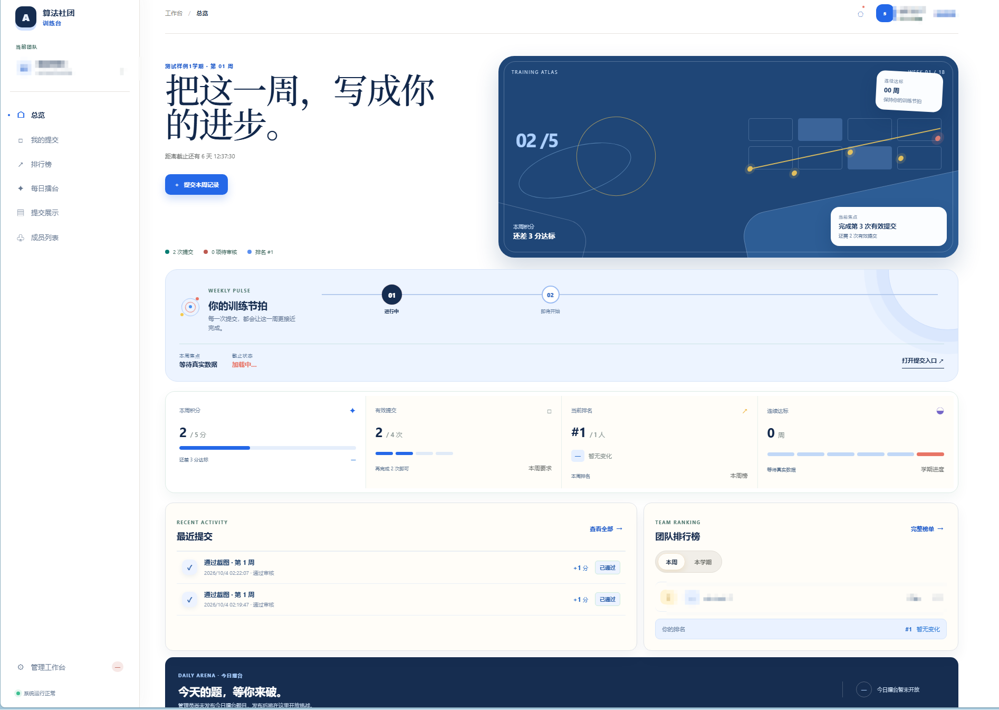
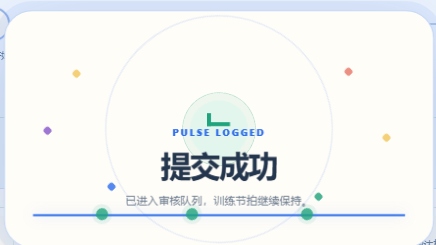
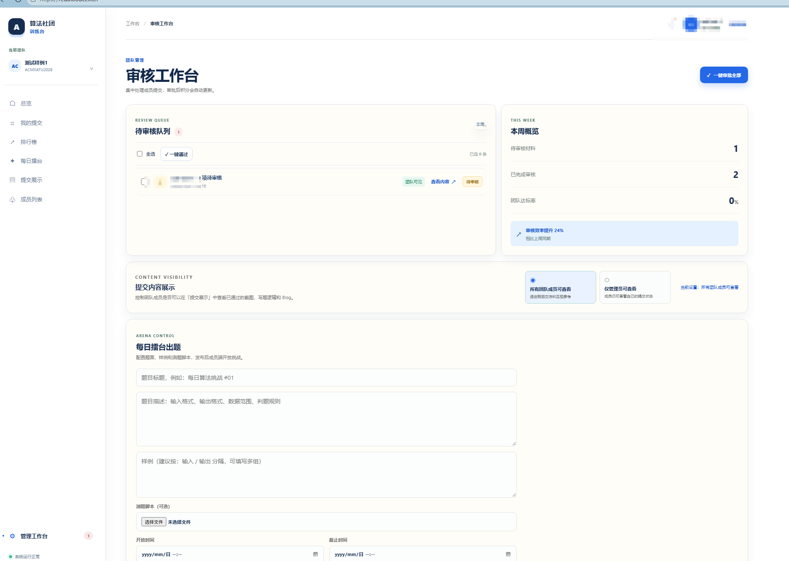
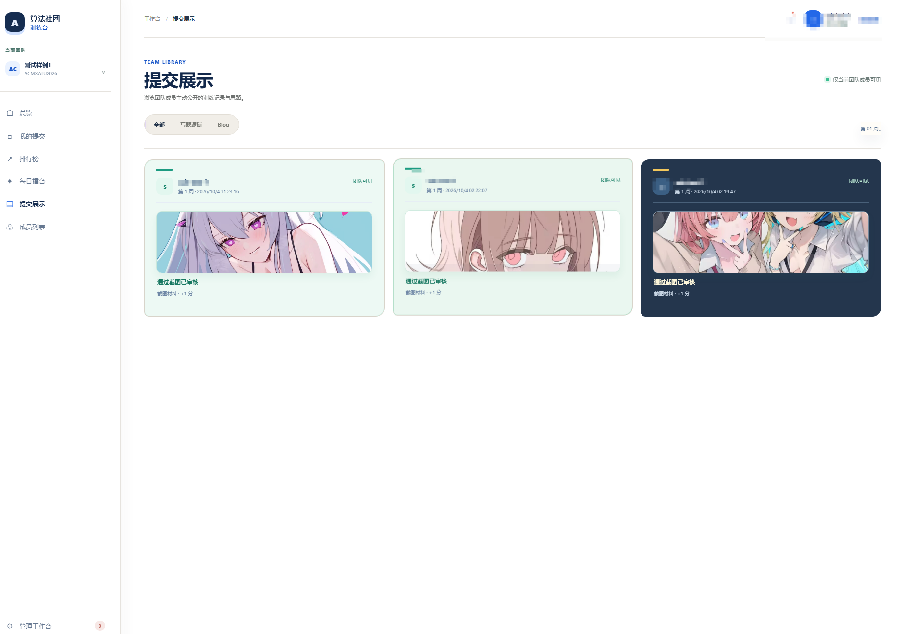

# 算法社团训练台

**A-Algorithm-Club-Training-Platform**

This project was born out of the need to make it easier to compile statistics on members’ training records and to encourage club members to train themselves.

这是一个 Django + PostgreSQL + Celery 的团队训练平台。当前版本保留了原有前端视觉，并提供团队、学期、周次、提交审核、展示权限、排行榜、成员历史和 Excel 导出接口。

## 界面展示

### 训练总览

工作台以当前周训练目标、积分进度和下一步提交动作作为入口。



### 提交成功反馈

提交成功后，页面会显示明确的反馈状态，并将记录送入审核队列。



### 管理员审核工作台

管理员可以集中处理待审核提交、查看材料并配置展示权限。



### 提交展示

团队成员可以在权限允许的范围内浏览已通过的训练材料。




## 本地启动

1. 安装 Docker Desktop，并确保代理可以拉取 Docker Hub 镜像。
2. 复制 `.env.example` 为 `.env`，替换密钥和数据库密码。
3. Windows 推荐运行 `powershell -ExecutionPolicy Bypass -File deploy/start.ps1`。脚本会自动使用稳定的传统构建器。
4. 访问 `http://localhost/`。
5. 创建管理员：`docker compose -p club-platform exec web python manage.py createsuperuser`。

开发团队可以用 `docker compose -p club-platform exec web python manage.py seed_demo` 创建演示团队，账号为 `林同学`，密码取命令参数默认值。演示团队的普通加入密码默认是 `join-me-2026`，管理员邀请码默认是 `admin-me-2026`；不填写或填写错误的管理员邀请码只会以普通成员加入。

## 正式部署

将项目上传到 Debian 12 服务器，配置 `.env` 中的域名和密码，开放 80/443 端口后运行 Docker Compose。Nginx 负责反向代理和媒体文件，PostgreSQL、Redis、Celery Worker/Beat 由 Compose 管理。

生产环境 `.env` 至少需要设置：

```dotenv
DJANGO_ALLOWED_HOSTS=redbloodcell.cn,www.redbloodcell.cn
DJANGO_CSRF_TRUSTED_ORIGINS=https://redbloodcell.cn,https://www.redbloodcell.cn
DJANGO_SECURE_COOKIES=1
DJANGO_SECURE_SSL_REDIRECT=1
DJANGO_HSTS_SECONDS=31536000
```

如果前面使用 Cloudflare，请将 SSL 模式设为 Full (strict)，并确保 Cloudflare 的 `X-Forwarded-Proto` 被 Nginx 转发给 Django。

更新前端或后端后，需要重新构建 Web、Worker、Beat 镜像并重启 Compose 服务；只替换浏览器里的 HTML 不会更新服务器数据库接口。

HTTPS 证书可以用 Certbot 写入 `deploy/certbot/conf`，证书更新后重新加载 Nginx。

## 重要规则

- 周次使用 `Asia/Shanghai`，每周一 00:00 开始，周日 24:00 截止并切换到下一周。
- 截止后的提交保存为无效，不计分。
- 截图、写题逻辑、Blog 独立审核和计分。
- 团队级展示权限统一控制；管理员始终可见，成员在“仅管理员可见”模式下仍可查看自己的材料。
- 学期结束 30 天后由 Celery 自动清理提交详情和媒体文件，只保留成员姓名与学期累计分数。
